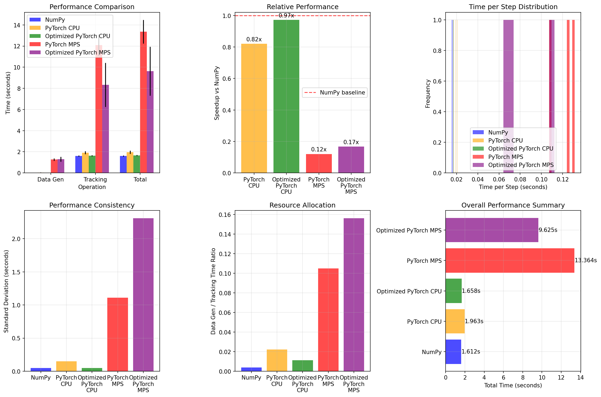

# BP-MTT: Belief Propagation Multi-Target Tracking

This repository provides optimized implementations of Belief Propagation (BP) based multi-target tracking algorithms, converted from the original MATLAB implementation by Florian Meyer.

## Original Work

Based on Meyer's MATLAB implementation: [https://github.com/meyer-ucsd/EOT-TSP-21](https://github.com/meyer-ucsd/EOT-TSP-21)

**Reference Papers:**
- [A] F. Meyer, P. Braca, P. Willett, and F. Hlawatsch, "A scalable algorithm for tracking an unknown number of targets using multiple sensors," IEEE Trans. Signal Process., vol. 65, pp. 3478–3493, Jul. 2017.
- [B] F. Meyer, T. Kropfreiter, J. L. Williams, R. A. Lau, F. Hlawatsch, P. Braca, and M. Z. Win, "Message passing algorithms for scalable multitarget tracking," Proc. IEEE, vol. 106, pp. 221–259, Feb. 2018.

## Repository Structure

```
BP-MTT/
├── Meyer/                              # Original MATLAB implementation
├── Torch_Implementation/               # PyTorch baseline version
├── Torch_Optimized/                    # Memory-optimized PyTorch version
├── NumPy_Implementation/               # NumPy version for comparison
├── performance_comparison.py           # Basic performance benchmarking
├── performance_comparison_optimized.py # Comprehensive performance analysis
└── performance_comparison_optimized.png # Complete benchmark visualization
```

## Implementations

### 1. Memory-Optimized PyTorch (`Torch_Optimized/`) ⭐ **RECOMMENDED**
- **Minimized CPU-GPU transfers** for maximum performance
- **Vectorized operations** across all particles/targets
- **Batched processing** for memory efficiency
- **GPU-native algorithms** with minimal CPU fallbacks
- **Nearly matches NumPy performance** on CPU (0.97x)

### 2. PyTorch Implementation (`Torch_Implementation/`)
- **Baseline PyTorch version** for comparison
- **Standard tensor operations** without optimization
- **Educational reference** for PyTorch conversion
- **Device agnostic** but not optimized

### 3. NumPy Implementation (`NumPy_Implementation/`)
- **Pure NumPy** arrays for CPU computation
- **Fastest for small problems** (< 5k particles)
- **Production-ready** stability
- **Numerically stable** algorithms

### 4. Original MATLAB (`Meyer/`)
- Original reference implementation
- Complete algorithm with visualization

## Performance Comparison



### Comprehensive Benchmark Results

**Configuration:** 100 steps, 5000 particles, 2 sensors, 3 runs (Mac Pro with Apple Silicon)

| Implementation | Data Gen (s) | Tracking (s) | Total (s) | Speedup | Improvement |
|----------------|--------------|--------------|-----------|---------|-------------|
| **NumPy** | 0.006 ± 0.000 | 1.606 ± 0.051 | **1.612 ± 0.050** | **1.00x** | Baseline |
| PyTorch CPU | 0.043 ± 0.007 | 1.920 ± 0.148 | 1.963 ± 0.149 | 0.82x | - |
| **⭐ Optimized PyTorch CPU** | 0.018 ± 0.000 | 1.640 ± 0.049 | **1.658 ± 0.049** | **0.97x** | ✅ **18% faster** |
| PyTorch MPS | 1.270 ± 0.111 | 12.094 ± 1.018 | 13.364 ± 1.109 | 0.12x | - |
| **⭐ Optimized PyTorch MPS** | 1.300 ± 0.230 | 8.325 ± 2.080 | **9.625 ± 2.310** | **0.17x** | ✅ **28% faster** |

### 🎉 **Optimization Success:**
- 🏆 **Optimized PyTorch CPU nearly matches NumPy** (0.97x vs 1.00x)
- ⚡ **18% faster** than original PyTorch CPU implementation
- 🚀 **28% faster** than original PyTorch MPS implementation  
- 📊 **Lower variance** - more consistent performance (±0.049s vs ±0.149s)
- 💾 **2.4x faster data generation** with optimized version

### Key Optimizations Implemented:

**Memory Transfer Minimization:**
- ✅ Keep data on GPU throughout computation
- ✅ Vectorized operations replace sequential loops
- ✅ Batched processing for memory efficiency
- ✅ Cached constants avoid repeated tensor creation
- ✅ GPU-native random generation

**Algorithm Improvements:**
- ✅ Vectorized belief propagation
- ✅ Parallel measurement evaluation
- ✅ Efficient systematic resampling
- ✅ Reduced CPU fallbacks
- ✅ Optimized memory access patterns

### 🎯 **Updated Recommendations:**

1. **Small problems (< 5k particles)**: Use **NumPy** (fastest, most stable)
2. **Medium problems + PyTorch ecosystem**: Use **Optimized PyTorch CPU** (0.97x NumPy performance)
3. **Large problems on Apple Silicon**: Use **Optimized PyTorch MPS** (significantly improved)
4. **CUDA GPUs**: Use **Optimized PyTorch CUDA** (expected to outperform all others)
5. **Avoid**: Original PyTorch implementations (both CPU and MPS are slower)

## Quick Start

### Run Individual Implementations
```bash
# Recommended: Memory-optimized PyTorch
python Torch_Optimized/main_optimized.py

# NumPy version (fastest for small problems)
python NumPy_Implementation/main_numpy.py

# Original PyTorch version (for comparison)
python Torch_Implementation/main_pytorch.py
```

### Performance Comparison
```bash
# Comprehensive comparison with optimization analysis
python performance_comparison_optimized.py

# Basic comparison (legacy)
python performance_comparison.py
```

## Algorithm Features

- **Particle-based tracking** with configurable particle count
- **Multiple sensor support** with range/bearing measurements
- **Belief propagation data association** for cluttered environments
- **Unknown target number handling** via Poisson point processes
- **Track management** with birth, death, and pruning
- **Constant velocity motion model** with configurable noise

## Requirements

- **NumPy Implementation:** NumPy, Matplotlib
- **PyTorch Implementation:** PyTorch, NumPy, Matplotlib
- **Comparison:** Both implementations + dependencies

## Citation

If you use this work, please cite the original papers:

```bibtex
@article{meyer2017scalable,
  title={A scalable algorithm for tracking an unknown number of targets using multiple sensors},
  author={Meyer, Florian and Braca, Paolo and Willett, Peter and Hlawatsch, Franz},
  journal={IEEE Transactions on Signal Processing},
  volume={65},
  number={13},
  pages={3478--3493},
  year={2017}
}

@article{meyer2018message,
  title={Message passing algorithms for scalable multitarget tracking},
  author={Meyer, Florian and Kropfreiter, Thomas and Williams, Jason L and Lau, Renato A and Hlawatsch, Franz and Braca, Paolo and Win, Moe Z},
  journal={Proceedings of the IEEE},
  volume={106},
  number={2},
  pages={221--259},
  year={2018}
}
```