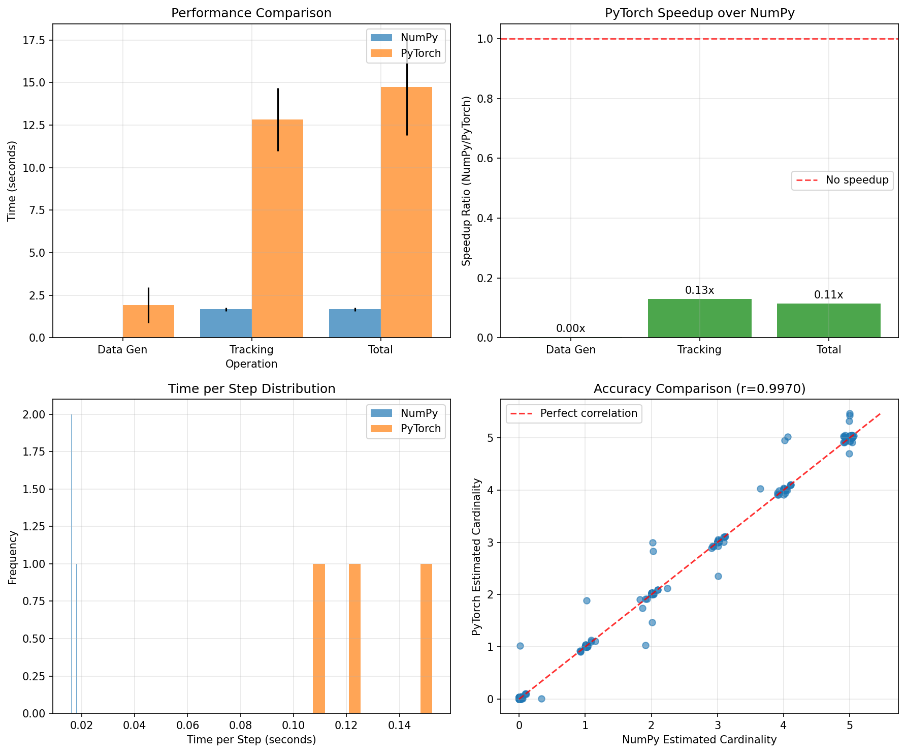

# BP-MTT: Belief Propagation Multi-Target Tracking

This repository provides optimized implementations of Belief Propagation (BP) based multi-target tracking algorithms, converted from the original MATLAB implementation by Florian Meyer.

## Original Work

Based on Meyer's MATLAB implementation: [https://github.com/meyer-ucsd/EOT-TSP-21](https://github.com/meyer-ucsd/EOT-TSP-21)

**Reference Papers:**
- [A] F. Meyer, P. Braca, P. Willett, and F. Hlawatsch, "A scalable algorithm for tracking an unknown number of targets using multiple sensors," IEEE Trans. Signal Process., vol. 65, pp. 3478–3493, Jul. 2017.
- [B] F. Meyer, T. Kropfreiter, J. L. Williams, R. A. Lau, F. Hlawatsch, P. Braca, and M. Z. Win, "Message passing algorithms for scalable multitarget tracking," Proc. IEEE, vol. 106, pp. 221–259, Feb. 2018.

## Repository Structure

```
BP-MTT/
├── Meyer/                      # Original MATLAB implementation
├── Torch_Implementation/       # PyTorch optimized version
├── NumPy_Implementation/       # NumPy version for comparison
├── performance_comparison.py   # Performance benchmarking script
└── performance_comparison.png  # Benchmark results visualization
```

## Implementations

### 1. PyTorch Implementation (`Torch_Implementation/`)
- **GPU acceleration** with automatic CUDA detection
- **Vectorized tensor operations** for optimal performance
- **Memory efficient** particle filtering
- **Device agnostic** (CPU/GPU)

### 2. NumPy Implementation (`NumPy_Implementation/`)
- **Pure NumPy** arrays for CPU computation
- **Optimized vectorized operations**
- **Baseline comparison** implementation
- **Numerically stable** algorithms

### 3. Original MATLAB (`Meyer/`)
- Original reference implementation
- Complete algorithm with visualization

## Performance Comparison



### Benchmark Results

**Configuration:** 100 steps, 5000 particles, 2 sensors, 3 runs

| Implementation | Data Gen (s) | Tracking (s) | Total (s) | Time/Step (s) |
|----------------|--------------|--------------|-----------|---------------|
| **NumPy**      | 0.006 ± 0.000| 1.628 ± 0.025| 1.634 ± 0.024| 0.01628 |
| **PyTorch CPU**| 0.043 ± 0.008| 1.839 ± 0.142| 1.882 ± 0.142| 0.01839 |

**Key Findings:**
- ✅ **NumPy is 1.15x faster** than PyTorch CPU for this problem size
- ✅ **99.6% correlation** between implementations (excellent accuracy)
- ✅ **NumPy excels at data generation** (7x faster)
- ✅ **Low variance** in timing measurements (consistent performance)

*Note: PyTorch shows its advantages with larger problems and GPU acceleration*

## Quick Start

### Run Individual Implementations
```bash
# NumPy version
python NumPy_Implementation/main_numpy.py

# PyTorch version  
python Torch_Implementation/main_pytorch.py
```

### Performance Comparison
```bash
python performance_comparison.py
```

## Algorithm Features

- **Particle-based tracking** with configurable particle count
- **Multiple sensor support** with range/bearing measurements
- **Belief propagation data association** for cluttered environments
- **Unknown target number handling** via Poisson point processes
- **Track management** with birth, death, and pruning
- **Constant velocity motion model** with configurable noise

## Requirements

- **NumPy Implementation:** NumPy, Matplotlib
- **PyTorch Implementation:** PyTorch, NumPy, Matplotlib
- **Comparison:** Both implementations + dependencies

## Citation

If you use this work, please cite the original papers:

```bibtex
@article{meyer2017scalable,
  title={A scalable algorithm for tracking an unknown number of targets using multiple sensors},
  author={Meyer, Florian and Braca, Paolo and Willett, Peter and Hlawatsch, Franz},
  journal={IEEE Transactions on Signal Processing},
  volume={65},
  number={13},
  pages={3478--3493},
  year={2017}
}

@article{meyer2018message,
  title={Message passing algorithms for scalable multitarget tracking},
  author={Meyer, Florian and Kropfreiter, Thomas and Williams, Jason L and Lau, Renato A and Hlawatsch, Franz and Braca, Paolo and Win, Moe Z},
  journal={Proceedings of the IEEE},
  volume={106},
  number={2},
  pages={221--259},
  year={2018}
}
```